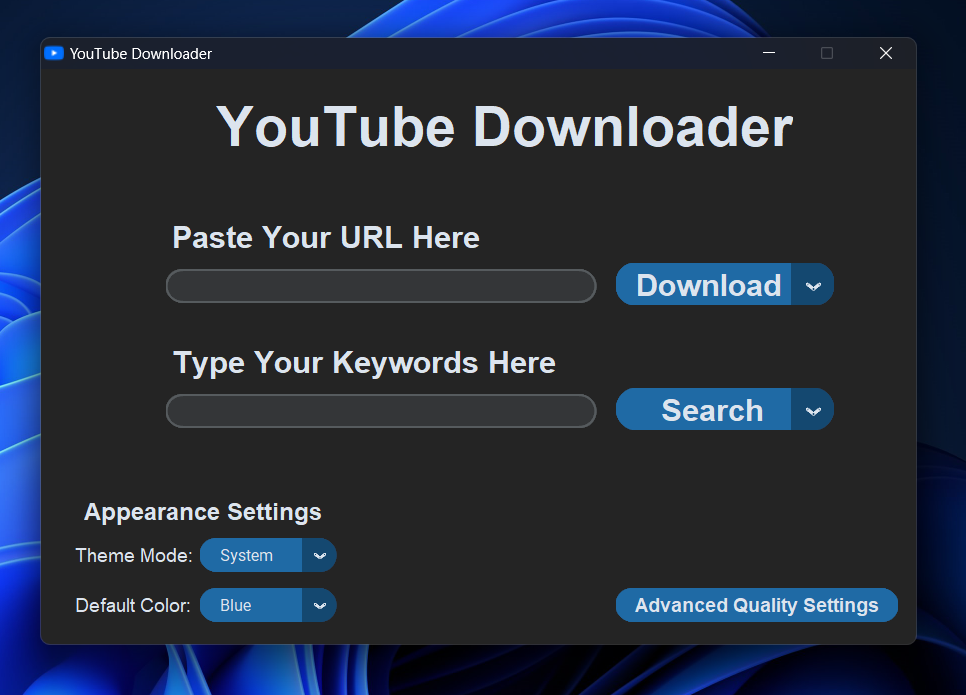
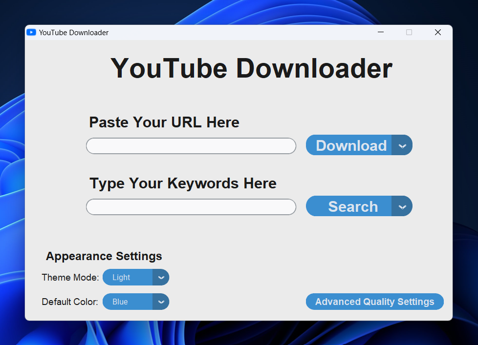
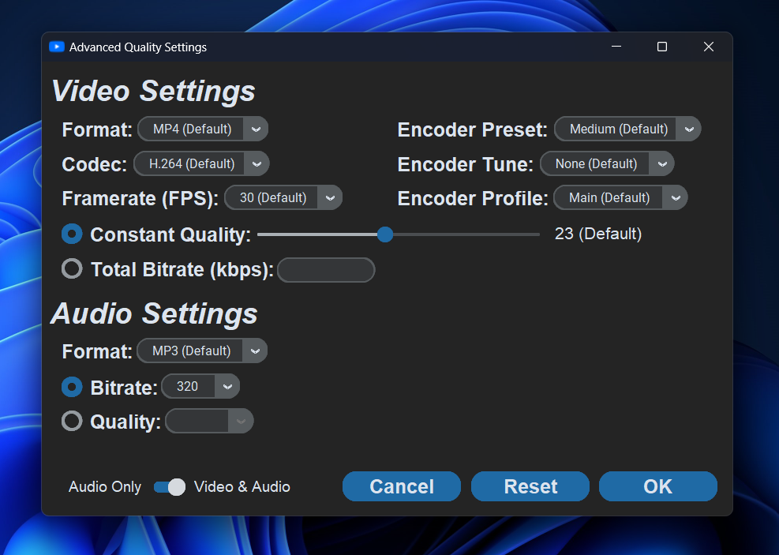
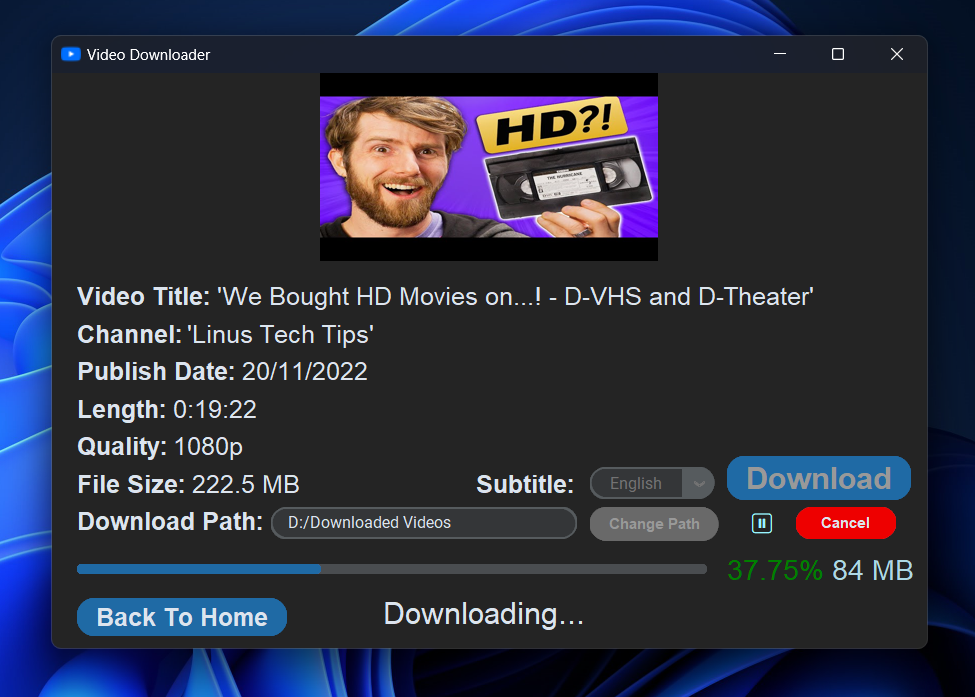
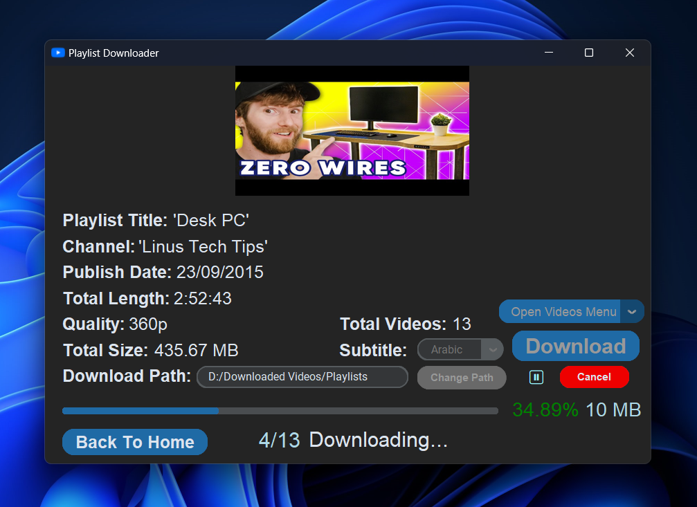
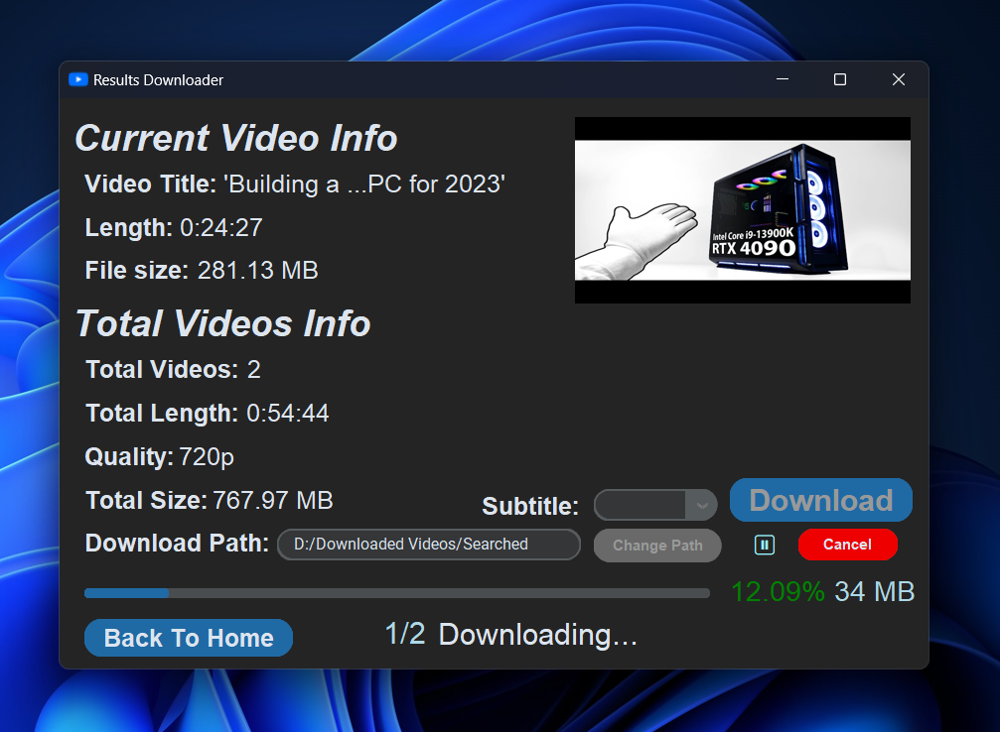

<div align = "center">
</img>


# **YouTube Downloader**

<!-- for github badges (buttons) https://shields.io/ -->

> **Simple & modern YouTube Downloader to download videos, playlists, subtitles and search queries.**

<a href='https://github.com/MAyman007/YouTube-Downloader/releases'></a><br>
</div>

## Features
<ul>
<li>🔗 Download videos by URL.</li>
<li>🗒️ Download playlists. With an option to select which videos to download.</li>
<li>💬 Download the attached subtitles. Or translate it to your prefered language.</li>
<li>🔎 Search keywords and download videos from the search results.</li>
<li>🔉 Download audio only</li>
<li>🔖 Selectable qualities.</li>
<li>⚙️ Advanced quality settings. (Change format, codec, bitrate, etc...)</li>
<li>🖼️ Download thumbnails.</li>
<li>⏯️ Supports resumability.</li>
<li>📂 Change the download path.</li>
<li>🌄 Simple & modern GUI.</li>
<li>🌃 Customize your theme and default color.</li>
</ul>

## Screenshots
<dl>
<figure>
</img>
<figcaption>| Home Page</figcaption>
</figure>
</dl>

<dl>
<figure>
</img>
<figcaption>| Home Page (Light)</figcaption>
</figure>
</dl>

<dl>
<figure>
</img>
<figcaption>| Advanced Quality Settings Page</figcaption>
</figure>
</dl>

<dl>
<figure>
</img>
<figcaption>| Video Downloader Page</figcaption>
</figure>
</dl>

<dl>
<figure>
</img>
<figcaption>| Playlist Downloader Page</figcaption>
</figure>
</dl>

<dl>
<figure>
</img>
<figcaption>| Search Results Page</figcaption>
</figure>
</dl>

<dl>
<figure>
</img>
<figcaption>| Results Downloader Page</figcaption>
</figure>
</dl>


## Installation Guide
### **For Windows:**
#### **Quick Install (Recommended):**
Download the exe for windows from the latest [release](https://github.com/MAyman007/YouTube-Downloader/releases).

---

#### **Build From Source:**

<ol>
<li>Install <a href = "https://www.python.org/downloads/">python</a> and <a href = "https://git-scm.com/downloads">git</a>, then make sure both are added to your <b>PATH</b>.</li>

<li>Download <a href="https://www.ffmpeg.org/download.html#build-windows">FFmpeg</a> and either:
<ul>
  <li>Add it to your <b>PATH</b>, or</li>
  <li>Place <code>ffmpeg.exe</code> in the same folder as the script.</li>
</ul></li>

<li>Git-clone this repo & change directory</li>

```
git clone https://github.com/MAyman007/YouTube-Downloader.git

cd YouTube-Downloader
```
<li>Install modules using pip</li>

```
pip install -r requirements.txt
```
<li>Run the .py file!</li>

```
py main.py
```
</ol>

### **For Linux:**
#### **Quick Install (Recommended):**
Download the prebuilt binary for Linux from the latest 
<a href="https://github.com/MAyman007/YouTube-Downloader/releases">release</a> 
and install 
<a href="https://www.ffmpeg.org/download.html#build-linux">ffmpeg</a> 
(<code>sudo apt install ffmpeg</code> if you're on a Debian-Based distro).

---

#### **Build From Source:**
<ol>
<li>Install the following packages:

<ul>
<li> For Debian-Based distros (Debian, Ubuntu, Mint, etc)

```
sudo apt update
sudo apt install -y python3 python3-pip python3-tk git ffmpeg
```
</li>
<li> Arch-Based Distros (Arch, Manjaro, EndeavourOS, etc.):

```
sudo pacman -Syu python tk git ffmpeg
```
</li>
<li> Fedora / RHEL-Based Distros:

```
sudo dnf install python3 python3-pip python3-tkinter git ffmpeg
```
</li>
<li> openSUSE:

```
sudo zypper install python3 python3-pip python3-tk git-core ffmpeg
```
</li>
</ul>
</li>

<li>Git-clone this repo & change directory

```
git clone https://github.com/MAyman007/YouTube-Downloader.git

cd YouTube-Downloader
```
</li>
<li>
Install modules using pip

```
pip install -r requirements.txt
```
</li>
<li>
Run the .py file!

```
python3 main.py
```
</li>
</ol>

## Support

Have questions, feedback, or issues? open an [issue](https://github.com/MAyman007/YouTube-Downloader/issues)
